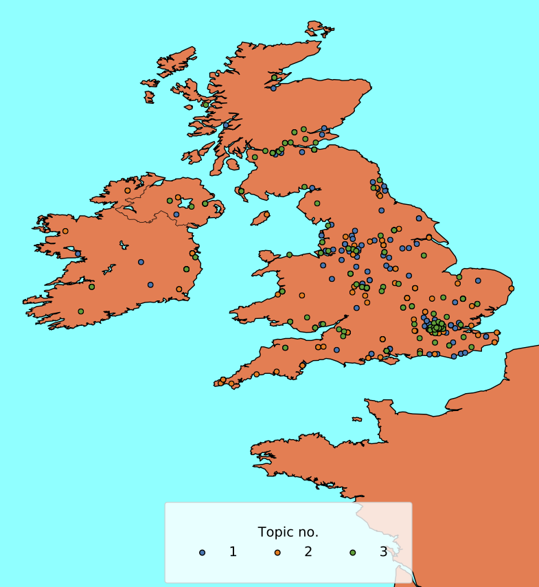
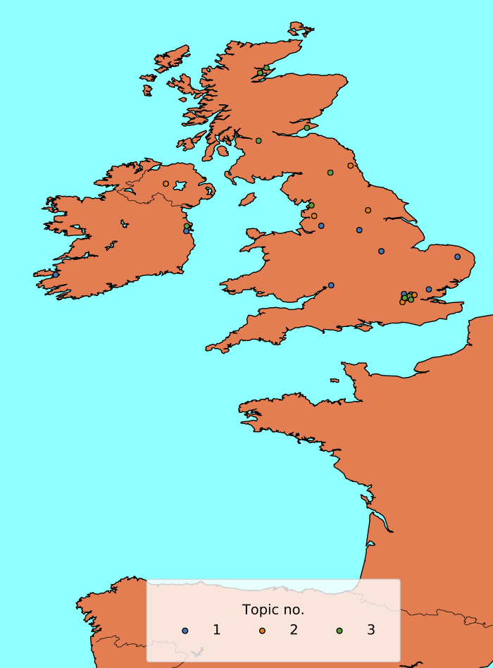

# Summary

The package TTLocVis provides a broad range of methods to generate, clean, analyze and visualize the contents of Twitter
data. TTLocVis enables the user to work with geo-spatial Twitter data and to generate topic distributions from Latent 
Dirichlet Allocation (LDA) Topic Models [@blei] for geo-coded Tweets. As such, TTLocVis is an innovative 
tool to work with geo-coded text on a high geo-spatial resolution to analyse the public discourse on various topics in 
space and time. The package can be used for a broad range of applications for scientific research to gain insights into 
topics discussed on Twitter. For instance, the package could be used to analyse the public discourse on the COVID-19 
pandemic on Twitter in different countries and regions in the world over time. In particular, 
data from the recently provided COVID-19 stream by Twitter can be analysed to research the discussion about COVID-19 
on Twitter.^[https://developer.twitter.com/en/docs/labs/covid19-stream/overview] In the following an overview of TTLocVis 
will be provided. Finally, it will be also discussed how TTLocVis extends existing related software solutions. 
The installation of TTLocVis can easily be done via pip. Further details on the installation and the package an be 
found in the packages repository or on the documentation website of TTLocVis.^[https://ttlocvis.readthedocs.io/en/latest/#installation]

In general, Topic Models are generative probabilistic models, that provide an insight into hidden information 
in large text corpora by estimating the underlying topics of the texts in an unsupervised manner. In Topic Models, 
each topic is a distribution over words that can be labeled by humans. For the purpose of labelling histograms and 
word clouds (for example see graph) provide helpful visualizations for the decision-making process of the user [@blei].

Firstly, the package allows the user to collect Tweets using a Twitter developer account for any area in the world.
Subsequently, the inherently noisy Twitter data can be cleaned, transformed and exported. 
In particular, TTLocVis enables the user to apply LDA Topic Models on extremely sparse Twitter data by preparing 
the Tweets for LDA analysis by the pooling Tweets by hashtags. The hashtags pooling algorithm [@Mehrotra] is implemented 
in a parallelized form in order to speed up the heavy computational task. The goal of hashtag pooling is to supply the 
Topic Models with longer documents than just single Tweets to reduce the problems of Topic Models to process short and 
sparse texts. The pooling idea can be summarized into the following steps: Pool all Tweets by existing hashtags and 
check the similarity of an unlabeled Tweet with all labeled Tweets (hashtag-pools). Subsequently, the unlabeled Tweets
join the hashtag-pool with the highest cosine similarity value, if the value exceeds a certain threshold. This process is 
repeated for all unlabeled Tweets. The resulting topic distributions that are computed with a LDA model that is trained 
on the pooled Tweets are substantially improved. When trained with sufficient data, clear topics can be generated and 
the shortcoming of LDAs with short and sparse text are minimized. 

TTLocVis provides options for automatized Topic Model parameter optimization. Furthermore, a distribution over 
topics is generated for each document. The distribution of topics over documents can be visualized with various 
plotting methods (for example see figure Word Cloud). The average prevalence of topics in the documents at each day can 
be plotted as a time series (for example see figure Time Series), in order to visualize, how topics develop over time.
 
Above this, the spatial distribution of Tweets can be plotted on a world map, which automatically chooses an appropriate
part of the world, in order to visualise the chosen sample of Tweets. As part of the mapping process, each Tweet is 
classified by its most prevalent topic and colour coded (for example see figure Word Map 1 and figure World Map 2 for 
the spatial distribution of the same selected topics at different points in time).

To the knowledge of the authors no Python Package with a comparable functionality of TTLocVis is currently available. 
A web tool that is most related to TTLocVis is TweetViz by [@stojanovski2014]. TweetViz provides word clouds and topic 
distributions for Twitter data. However, TTLocVis improves on TweetViz by optimizing the LDA input with tweet pooling and
options for geo-spatial and temporal analysis. Further, a major limitation of TweetViz is that the number of topic for 
the LDA estimation is always fixed at 20. TTLocVis gives the option to define a range of potential topic numbers and 
also includes an algorithm to select the optimal topic number according to coherence scoring. 

Alternatively, Twitter data may be analyzed with a web application by [@malik2013] with a LDA Topic Model. 
The authors use so-called bins resembling time intervals for the Topic Model estimation. For each of these bins,
a LDA Topic Model is estimated in order to account for the topical change over time. They then use cosine similarity 
to align the topics from the several bins to a resulting topic. In contrast to this approach, the LDA model is trained 
on pooled tweets in TTLocVis in order to improve the estimation results. The estimation procedure in [@malik2013] could 
be beneficial in the modelling of topical changes in short time intervals. However, in this framework Topic Models are 
estimated on very small samples on which LDA Models usually do not perform well.  

A further web application for the analysis of Tweets is provided by [@onorati2019]. They offer functionality to generate
word clouds, tree maps and map visualization. In contrast to TTLocVis, they do not estimate 
their topics by LDA, but rather use semantic relations. The focus of their application is on the contents of individual 
tweets with regard to disaster-related classification.

In [@hu2016] a framework for social media text analysis is provided. In contrast to our approach, 
the selected words are choosen by a mix of frequency and sentence structure rather than by LDA Topic Models.  
The package does not provide options for a visualisation of the spatial or time dimension. 

A recent analysis of COVID-19 related Tweets can be found in [@kong2020]. They use the packages Birdspotter and
Evently in order to analyse retweet cascades. Birdspotter is a package to analyze social influence and Botness of 
Twitter users, while Evently can be used to model the temporal spread of information. 

 
# Figures

{ width=80% }

{ width=80% }

{ width=100% }

{ width=80% }

# References